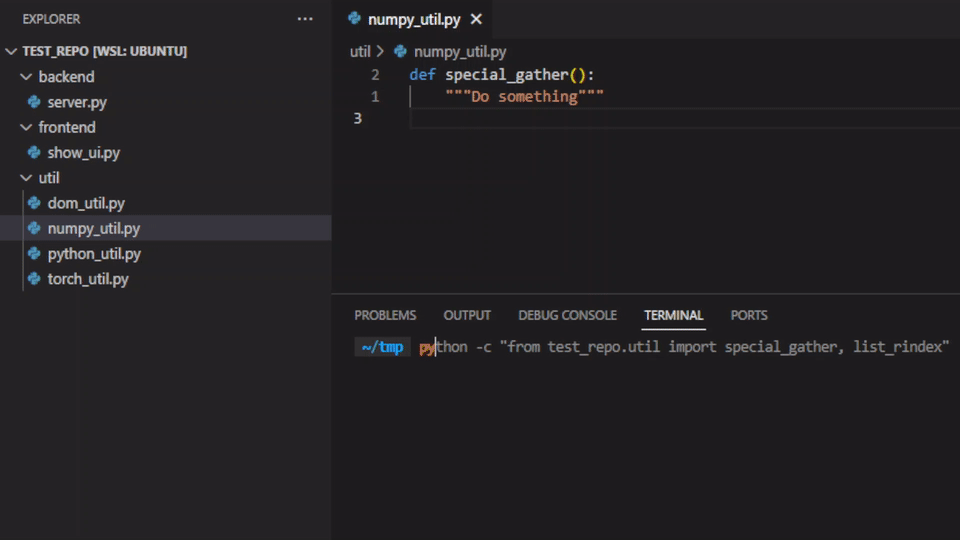

# Automatically create __init__.py files for your whole project

## Motivation
Let's say I have this python project structure (And you installed test_repo into your python environment)
```
test_repo/
├── backend
│   └── server.py
├── frontend
└── util
    ├── dom_util.py
    ├── numpy_util.py
    ├── python_util.py
    └── torch_util.py
```
Now when I want to import a lot of utilities in `server.py`, I'll have to write
```python
from test_repo.util.dom_util import dom_loader
from test_repo.util.numpy_util import special_gather
from test_repo.util.torch_util import rolling_window
from test_repo.util.python_util import list_rindex
```
This is cubersome and annoying for anyone using the package externally. Packageinit will automatically create an `__init__.py` file inside `test_repo/util` that imports all non-private methods, modules, variables and constants defined in the python files from `test_repo/util`. Afterwards, you can instead just import all the utilities using
```python
from test_repo.util import dom_loader, special_gather, rolling_window, list_rindex
```
## Installation
`pip install packageinit`. Optionally install black formatter using `pip install black` for nicely formatted `__init__.py` files.  
Alternatively, clone this repo and install with `pip install -e .`
## Usage
### Individual import mode
`autoinit project_folder`. This will create `__init__.py` in each `project_folder` and each subfolder that contains `.py` files. Each `__init__.py` file will import all methods, classes, constants and variables defined in each `.py` file of its folders via relative import.

**Warning**: This may overwrite exisiting `__init__.py` files. It tries to preserve anything not import related in existing `__init__.py` files, but that only works if they come after the imports.
**Warning**: For this to work, all imports in your .py files have to be at the top of your files.
**Warning**: All `.py` files in your `project_folder` have to be importable without error for this to work.

### Starred mode
`autoinit project_folder --starred`. This will create `__init__.py` in each `project_folder` and each subfolder that contains `.py` files. Each `__init__.py` file include `from .yourfilename import *` for each `.py` file in it's folder.
**Warning**: Importing using `*` may result in cylclic imports depending on the rest of your import structure in the code.